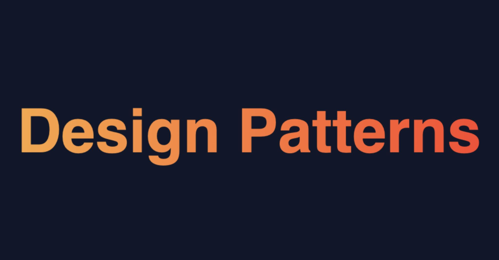

# Design Patterns

Design patterns are a collection of best practices used to solve common software development problems. They are reusable solutions that have been time-tested and proven. iOS development employs four main categories of design patterns, which are:

1. Creational 🏭

Creational Design Patterns are employed to create objects in a flexible and reusable way. They enable the creation of objects without the need for their precise class or implementation details. Creational patterns are useful for complex object-creation processes that require additional logic. They provide a modular, maintainable, and scalable way of creating objects.

2. Structural 🏗️

Structural Design Patterns focus on how objects are structured into larger configurations. They provide a clear and consistent way of organizing code and user interface elements. Structural patterns describe the relationships between objects, classes, and interfaces, allowing for more modular and reusable code. Structural patterns improve code organization, ease of maintenance, and scalability.

3. Behavioral 🗣️

Behavioral Design Patterns address object communication and responsibility allocation. They provide a flexible and extensible means of managing object communication. Behavioral patterns specify how objects interact and allocate responsibilities. They facilitate the development of flexible and extensible applications that can adapt to evolving requirements. Behavioral patterns enhance code flexibility, extensibility, and ease of modification over time.

4. Architectural 🏰

Architectural Design Patterns define the general structure and organization of an application. They provide a technology and framework-independent way of organizing code and user interface elements. Architectural patterns describe how application components are organized, interact, and communicate with each other. They provide an easy way of creating maintainable and scalable applications. Architectural patterns improve code modularity, scalability, and ease of maintenance over time.

In conclusion, understanding and implementing design patterns are critical to developing maintainable and scalable iOS applications. Each design pattern category provides unique benefits that can aid in achieving development goals. Utilizing design patterns in code development enhances flexibility, maintainability, and ease of understanding and debugging.

